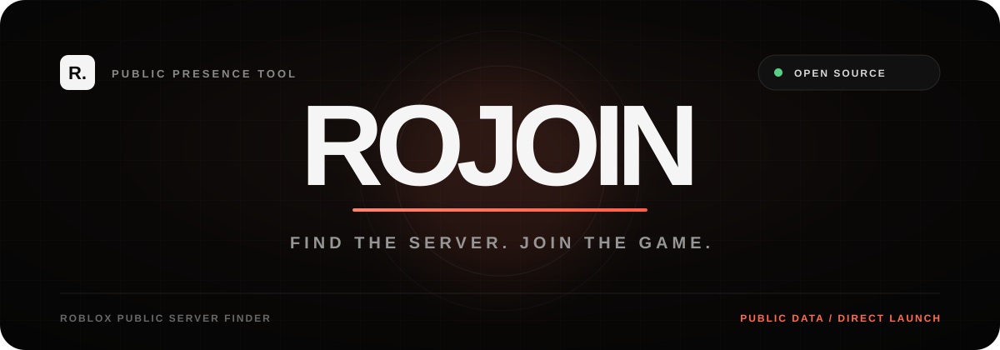

<div align="center">
  

  <br />

  <a href="https://github.com/xtofuub/RoJoin/blob/main/LICENSE"></a>
  <a href="https://github.com/xtofuub/RoJoin"></a>
  <a href="https://vercel.com/new/clone?repository-url=https%3A%2F%2Fgithub.com%2Fxtofuub%2FRoJoin&repository-name=rojoin"></a>

  <p>
    A transparent, privacy-respecting website for finding and joining a player's<br />
    <strong>publicly visible Roblox server</strong> using Roblox-owned public endpoints.
  </p>

  <p>
    <a href="#-getting-started"><strong>Run locally</strong></a>
    ·
    <a href="#-how-it-works"><strong>How it works</strong></a>
    ·
    <a href="#-privacy-boundary"><strong>Privacy</strong></a>
    ·
    <a href="https://vercel.com/new/clone?repository-url=https%3A%2F%2Fgithub.com%2Fxtofuub%2FRoJoin&repository-name=rojoin"><strong>Deploy</strong></a>
  </p>
</div>

---

## Why RoJoin?

RoJoin provides a lightweight, open-source way to look up a Roblox player's publicly visible presence and open their exact game instance when Roblox makes it available.

The entire implementation is inspectable and runs without Roblox passwords, `.ROBLOSECURITY` cookies, analytics, a database, or hidden third-party services.

> **Find the server. Join the game.**

## Features

- **Public presence lookup** — resolve a Roblox username and inspect the presence fields Roblox exposes publicly.
- **Exact server launch** — open the Roblox desktop player when Roblox returns both a place ID and game instance ID.
- **Zero credentials** — no Roblox login, session cookie, API key, or OAuth flow.
- **Server-side requests** — avoids browser CORS workarounds and keeps the client simple.
- **Clear privacy states** — distinguishes offline, online, in-game-hidden, and joinable results.
- **Midnight editorial UI** — responsive dark interface with reduced-motion support.
- **Small attack surface** — dependency-free local runtime and no tracking stack.

## How it works

```text
Username
   │
   ▼
Resolve public Roblox user ID
   │
   ▼
Request public presence + avatar
   │
   ├── Exact game instance exposed ──► Open Roblox player
   │
   └── Instance hidden/offline ──────► Explain the privacy boundary
```

The backend calls Roblox-owned endpoints for username resolution, profile information, avatar thumbnails, public presence, and optional game metadata.

RoJoin does **not** enumerate server avatar tokens or attempt to defeat Roblox privacy and join settings. If Roblox omits the game instance ID, the exact-server action remains unavailable.

## Getting started

### Requirements

- Node.js 20 or newer
- No environment variables
- No package installation required

### Run locally

```bash
git clone https://github.com/xtofuub/RoJoin.git
cd RoJoin
npm run dev
```

Open `http://localhost:3000`.

### Validate the source

```bash
npm run check
```

This checks the local server, API handler, Roblox client, and browser JavaScript syntax.

## Deploy to Vercel

<div align="center">
  <a href="https://vercel.com/new/clone?repository-url=https%3A%2F%2Fgithub.com%2Fxtofuub%2FRoJoin&repository-name=rojoin">
    
  </a>
</div>

Use the **Other** framework preset. No build command or environment variables are required.

Vercel serves the interface from `public/` and runs `api/search.js` as a serverless function. Once the GitHub repository is connected in Vercel, every push to `main` creates a new production deployment and other branches receive preview deployments.

## Privacy boundary

| RoJoin does | RoJoin does not |
|---|---|
| Use Roblox-owned public endpoints | Request your Roblox password |
| Show only publicly returned presence data | Read `.ROBLOSECURITY` cookies |
| Open an exact server when Roblox exposes it | Enter private or reserved servers |
| Return explicit hidden/offline states | Bypass account privacy settings |
| Apply basic request rate limiting | Store a searchable player-history database |

## Project structure

```text
.
├── api/
│   └── search.js          # Rate-limited Vercel serverless endpoint
├── assets/
│   └── rojoin-readme.svg  # README artwork
├── lib/
│   └── roblox.js          # Roblox API client and response mapping
├── public/
│   ├── index.html         # Main interface
│   ├── app.js             # Search and result rendering
│   ├── styles.css         # Style entry point
│   ├── base.css           # Global visual foundation
│   ├── components.css     # UI components and page sections
│   ├── responsive.css     # Mobile and reduced-motion behavior
│   └── favicon.svg
├── server.mjs             # Dependency-free local development server
├── vercel.json            # Routes and security headers
└── package.json
```

## API response states

| State | Meaning |
|---|---|
| `JOINABLE` | Roblox exposed both the place and exact game instance. |
| `IN_GAME_HIDDEN` | The player appears in a game, but the exact server is not public. |
| `ONLINE_NOT_IN_GAME` | The player is online but not currently in a joinable game. |
| `OFFLINE` | Roblox reports the player as offline. |

## Security

RoJoin intentionally avoids account authentication and persistent storage. The included Vercel configuration adds restrictive browser security headers, and the API route applies basic per-instance IP rate limiting.

Found a security issue? Please avoid posting sensitive exploit details publicly. Open a minimal issue describing the affected component, or contact the maintainer privately through their GitHub profile.

## Contributing

Bug reports and focused pull requests are welcome. Keep changes transparent, dependency-light, and within the project's public-data-only privacy boundary.

1. Fork the repository.
2. Create a focused branch.
3. Run `npm run check`.
4. Submit a pull request explaining the behavior change.

## Disclaimer

RoJoin is an independent open-source project and is not affiliated with, endorsed by, or sponsored by Roblox Corporation. Roblox may change or rate-limit its public endpoints at any time.

## License

Released under the [MIT License](./LICENSE).
