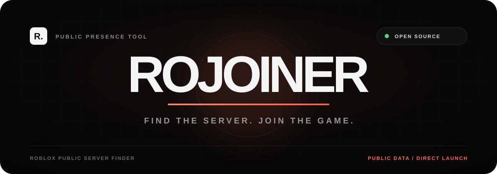

<div align="center">
  

  <br />

  <a href="./LICENSE"></a>
  <a href="https://rojoiner-web.vercel.app"></a>
  <a href="./companion"></a>

  <p>
    An open-source Roblox joining toolkit for public player lookup, server browsing,<br />
    relationship checks, local favourites, share links, and optional online-friend access.
  </p>
</div>

---

## Why RoJoiner?

Roblox joining tools often ask users to install extensions with unclear permissions. RoJoiner keeps the normal website useful without account access, documents every privacy boundary, and provides a small optional companion whose complete source and permissions can be reviewed before installation.

The website does not request Roblox passwords, `.ROBLOSECURITY` cookies, analytics consent, or a RoJoiner account.

## Toolkit

### Players

- Resolve a Roblox username and public profile.
- Display public presence, location, account creation date, avatar, and social counts.
- Open an exact game instance when Roblox returns a `gameInstanceId`.
- Fall back to a Roblox-controlled `userId` join request when the exact instance is hidden.
- Explain which presence and server fields Roblox returned.
- Save a player locally or create a shareable `/player/<username>` link.

### Servers

- Accept a Roblox game URL or numeric Place ID.
- Display game metadata, icon, creator, visits, live player count, and server capacity.
- Browse up to 100 public servers per page.
- Sort smallest-first or largest-first and optionally hide full servers.
- Join the smallest open server, largest open server, or a random server.
- Rejoin a recently opened server.
- Save games locally and create shareable game or exact-server links.

Public server listings expose instance IDs and capacity information, but Roblox currently leaves player identity arrays empty. RoJoiner therefore does not claim to reveal which hidden player is inside a server.

### Compare

- Compare two Roblox usernames.
- Show whether the accounts are public friends.
- Display public friend, follower, and following counts.
- Calculate and display mutual public friends.

### Local library

Favourite players, favourite games, and recently opened servers are stored in browser `localStorage`. The Library tab includes individual removal controls and a clear-all action. The included app has no remote history database.

### Friends companion

The optional [`companion/`](./companion) extension displays the online friends visible to the Roblox account already signed in within the browser.

- No browser `cookies` permission.
- No direct `.ROBLOSECURITY` access.
- Authenticated requests go directly to Roblox domains.
- No friend data or session data is sent to the RoJoiner website.
- Chromium and Firefox source-install instructions are included.

See the [companion permission review and installation guide](./companion/README.md).

## Share routes

```text
/player/<username>
/game/<placeId>
/server/<placeId>/<gameInstanceId>
```

The route resolves live data when opened. RoJoiner does not publish a historical record of where players were located.

## Architecture

```text
Browser
  ├── Players ──────► /api/search  ──► users / presence / friends / thumbnails
  ├── Servers ──────► /api/game    ──► games / universes / thumbnails
  ├── Compare ──────► /api/compare ──► users / public friend lists
  └── Library ──────► localStorage only

Optional companion
  └── Browser-managed Roblox session ──► authenticated online-friends endpoint
```

## Run locally

Requirements:

- Node.js 20 or newer
- No environment variables
- No package installation required

```bash
git clone https://github.com/xtofuub/RoJoiner.git
cd RoJoiner
npm run check
npm run dev
```

Open `http://localhost:3000`.

## Deploy to Vercel

Import `xtofuub/RoJoiner` as an **Other** framework project. No build command or environment variables are required.

Vercel serves the static interface from `public/` and runs the three Node.js functions in `api/`. Pushes to `main` create production deployments through the connected Git integration.

## Project structure

```text
.
├── api/
│   ├── search.js           # Player lookup endpoint
│   ├── game.js             # Game metadata and public servers
│   └── compare.js          # Relationship and mutual-friend checks
├── companion/
│   ├── manifest.json       # Optional browser companion
│   ├── popup.html
│   ├── popup.css
│   ├── popup.js
│   └── README.md
├── lib/
│   └── roblox.js           # Roblox API client and response mapping
├── public/
│   ├── index.html          # Multi-tool interface
│   ├── app.js              # Tabs, rendering, storage, sharing, launches
│   ├── styles.css          # Complete responsive visual system
│   └── favicon.svg
├── server.mjs              # Dependency-free local runtime
├── vercel.json             # Functions, share routes, and security headers
└── package.json
```

## Privacy boundary

| RoJoiner does | RoJoiner does not |
|---|---|
| Use Roblox-owned public endpoints | Ask for a Roblox password |
| Browse public server instances | Reveal hidden server membership |
| Use Roblox-native launch links | Enter private or reserved servers without access |
| Store favourites in the current browser | Upload a searchable player history |
| Explain hidden and unavailable states | Bypass account privacy or join settings |

Roblox always makes the final decision about whether a player or server can be joined.

## Security

- Restrictive Content Security Policy and browser security headers.
- Per-instance API rate limiting on player lookups.
- Request timeouts and normalized public errors.
- No third-party client scripts, analytics SDKs, or external database.
- Companion permissions are deliberately limited and documented.

Please report security issues privately through the maintainer's GitHub profile rather than publishing sensitive exploit details.

## Disclaimer

RoJoiner is an independent open-source project and is not affiliated with, endorsed by, or sponsored by Roblox Corporation. Roblox can change, remove, or rate-limit its endpoints at any time.

## License

Released under the [MIT License](./LICENSE).
